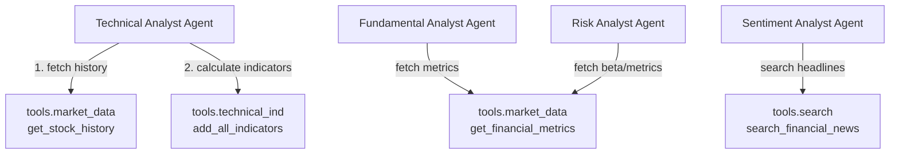

# Agent and Tool Flow & Schemas

This document illustrates the specific tools each agent invokes, along with the input schemas required by those tools and the output schemas produced by both the tools and the agents themselves.

## Flow Diagram



---

## 1. Technical Analyst Agent
**Responsibility:** Analyzes price action and technical indicators.
* **Input State:** `{"ticker": str}`
* **Output State Update:** `{"technical_analysis": str}`

### Tools Called
1. `get_stock_history`
   * **Input:** `ticker: str`, `period: str` (e.g., "3mo")
   * **Output:** `pandas.DataFrame` (Columns: Date, Open, High, Low, Close, Volume)
2. `add_all_indicators`
   * **Input:** `df: pandas.DataFrame`
   * **Output:** `pandas.DataFrame` (Appends SMA, EMA, RSI, MACD columns)

---

## 2. Fundamental Analyst Agent
**Responsibility:** Evaluates company health, margins, and valuation ratios.
* **Input State:** `{"ticker": str}`
* **Output State Update:** `{"fundamental_analysis": str}`

### Tools Called
1. `get_financial_metrics`
   * **Input:** `ticker: str`
   * **Output:** `Dict` (Contains: marketCap, peRatio, eps, dividendYield, profitMargins, debtToEquity, etc.)

---

## 3. Sentiment Analyst Agent
**Responsibility:** Reads recent news to gauge market mood.
* **Input State:** `{"ticker": str, "user_query": str}`
* **Output State Update:** `{"sentiment_analysis": str}`

### Tools Called
1. `search_financial_news`
   * **Input:** `query: str` (e.g., "RELIANCE share news Indian stock market"), `max_results: int`
   * **Output:** `List[Dict]` (Each dict contains: title, snippet, date, source, url)

---

## 4. Risk Analyst Agent
**Responsibility:** Assesses the volatility and risk profile of the stock.
* **Input State:** `{"ticker": str}`
* **Output State Update:** `{"risk_analysis": str}`

### Tools Called
1. `get_financial_metrics`
   * **Input:** `ticker: str`
   * **Output:** `Dict` (Specifically utilizes: beta, fiftyTwoWeekHigh, fiftyTwoWeekLow, debtToEquity)

---

## 5. The Judge Node
**Responsibility:** Synthesizes the 4 analyst reports and makes a final verdict.
* **Input State:** 
  ```json
  {
    "ticker": str,
    "technical_analysis": str,
    "fundamental_analysis": str,
    "sentiment_analysis": str,
    "risk_analysis": str
  }
  ```
* **Output State Update:** `{"final_recommendation": str}` (Must end with BUY, HOLD, or SELL)
* **Tools Called:** None (Purely an LLM synthesis node).
